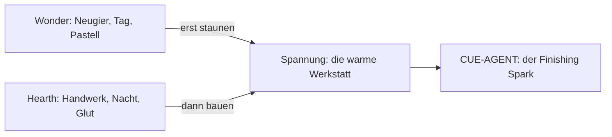
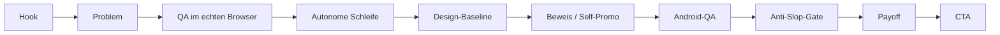
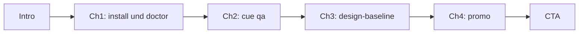
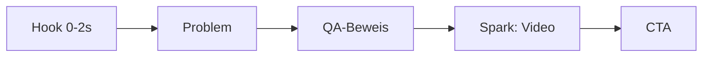
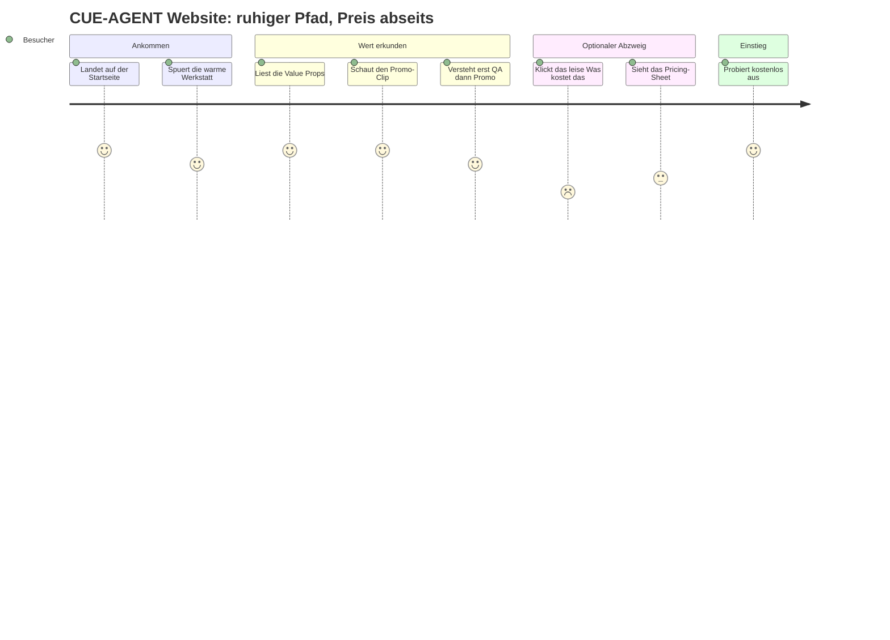
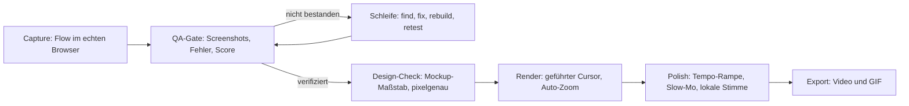

# CUE-AGENT — storyboards

Stimme: HEARTHWORK. Ruhig, warm, ehrlich. Glut statt Feuer. Keine Ausrufezeichen. Die Bilder folgen der Design-Sprache: große ruhige Flächen, kleine faszinierende Details, sanfte Bewegungen (schweben, atmen, gleiten), weiche Pastell- und Ember-Verläufe.

---

## 1. Die zwei Erzählschichten: Wonder und Hearth

CUE-AGENT erzählt jedes Video aus zwei Polen, die zusammen die Spannung machen.

- **Wonder (Neugier, Tag):** Pilz, Tautropfen, Blume, Insekt. Steht für das Staunen — "schau mal, was hier passiert". Farbakzente: Hearth Pink, Lavender Mist, Mint Whisper, Sky Glow.
- **Hearth (Handwerk, Nacht):** Glut, Laterne, Funke, Schmiedespur, Abendlicht. Steht für Orientierung — "jemand baut daraus etwas". Basisfarben: Ember, Forge, Hearth, Lantern, Twilight, Smoke.

Die Magie entsteht genau zwischen diesen Polen: die Welt ist voller Wunder, aber jemand muss daraus etwas bauen. Im Video heißt das: das Staunen eröffnet, das Handwerk hält. QA ist Hearth, Promo ist Wonder — in dieser Reihenfolge.

---

## 2. Storyboard 1 — Promo (~90s, 16:9)

| Szene | Sekunden | Visual | On-Screen-Text | VO (Deutsch) |
| --- | --- | --- | --- | --- |
| Hook | 0–8 | Dunkle Werkstatt, ein einzelner Funke wächst zur Glut, weicher Ember-Verlauf | "Erst der Beweis." | "Bevor du etwas zeigst, sollte es halten." |
| Problem | 8–18 | App-Screen mit stillem roten Konsolen-Glühen, Tautropfen am Rand | "Bugs sieht man oft zu spät." | "Fehler verstecken sich gern dort, wo niemand hinschaut." |
| QA | 18–32 | Echter Browser öffnet sich, Screenshots gleiten herein, Netzwerk-Log atmet | "Echter Browser. Echte Fehler." | "CUE-AGENT öffnet deine App wie ein Mensch und sammelt, was wirklich passiert." |
| Schleife | 32–44 | Kreislauf-Animation find, fix, rebuild, retest, Laterne pulsiert ruhig | "Find, fix, rebuild, retest." | "Eine ruhige Schleife arbeitet weiter, bis der Flow hält." |
| Baseline | 44–56 | Mockup legt sich als feines Raster über den echten Screen, Pixel rasten ein | "Dein Mockup ist der Maßstab." | "Dein Entwurf wird zum Maßstab — Position, Größe, Text und Farbe, pixelgenau." |
| Beweis | 56–66 | Report mit Score und Schweregrad, grünes Mint-Whisper-Häkchen | "Verifiziert." | "Erst wenn der Beweis steht, geht es weiter." |
| Android | 66–76 | Telefon-Rahmen, Tap-Geste, Screen-Wechsel landet sauber | "Landet der Tap richtig?" | "Auch auf Android: Abstürze, ANRs und die Frage, ob der Tap im richtigen Screen landet." |
| Gate | 76–82 | Tor aus Glut öffnet sich nur für geprüfte Flows | "Erst QA, dann Promo." | "Das Gate lässt nur durch, was geprüft ist." |
| Payoff | 82–88 | Geführter Cursor, Auto-Zoom, Tempo-Rampe, weiches Slow-Mo | "Zeig es schöner." | "Aus dem geprüften Flow wird ein ruhiges, schönes Video." |
| CTA | 88–90 | Logo-Funke im Kreis, Install-Zeile | "npx github:Lootziffer666/CUE-AGENT" | "Probier es aus, tausch dich aus, bring Ideen ein." |

---

## 3. Storyboard 2 — Tutorial (~80s, 16:9)

| Szene | Sekunden | Visual | On-Screen-Text | VO (Deutsch) |
| --- | --- | --- | --- | --- |
| Intro | 0–10 | Werkbank im Abendlicht, Terminal und GUI nebeneinander | "In vier ruhigen Schritten." | "Wir gehen das gemeinsam durch — Schritt für Schritt." |
| Ch1 install | 10–26 | Terminal tippt npx-Zeile, doctor-Check setzt grüne Punkte | "npx github:Lootziffer666/CUE-AGENT" | "Installier es mit einer Zeile und lass doctor prüfen, ob alles bereit ist." |
| Ch2 cue qa | 26–44 | Browser startet, Screenshots und Fehlerliste füllen den Report | "cue qa" | "Starte einen QA-Lauf — echter Browser, Screenshots, Konsolen- und Netzwerkfehler, klarer Report." |
| Ch3 baseline | 44–60 | Upload eines Mockups, Overlay rastet pixelgenau ein | "Mockup als Maßstab" | "Lade dein Mockup hoch. Position, Größe, Text und Farbe werden pixelgenau geprüft, automatisch nachjustiert." |
| Ch4 promo | 60–74 | Geführter Cursor zeichnet den Flow, Auto-Zoom, GIF-Export | "Aus geprüftem Flow" | "Aus einem verifizierten Flow baust du das Video — geführter Cursor, Auto-Zoom, lokale Stimme, GIF-Export." |
| CTA | 74–80 | Logo-Funke, Repo-Link, ruhiger Ausklang | "ausprobieren — austauschen — Ideen einbringen" | "Probier es aus und sag uns, was du brauchst." |

---

## 4. Storyboard 3 — 9:16 Short (~20s)

| Beat | Sekunden | Visual | On-Screen-Text | VO (Deutsch) |
| --- | --- | --- | --- | --- |
| Hook | 0–2 | Einzelner Funke springt im Dunkeln an | "Erst prüfen." | "Erst prüfen." |
| Problem | 2–7 | Roter Konsolenfehler glüht kurz auf | "Bugs zuerst." | "Finde den Bug, bevor ihn andere finden." |
| QA-Beweis | 7–13 | Browser, Screenshot, grünes Häkchen | "Verifiziert." | "Echter Browser, echter Beweis." |
| Spark | 13–18 | Cursor gleitet, Auto-Zoom, weiches Glühen | "Dann schön." | "Dann wird daraus ein ruhiges Video." |
| CTA | 18–20 | Logo-Funke, Install-Zeile | "npx github:Lootziffer666/CUE-AGENT" | "Probier es aus." |

---

## 5. Website-Userflow — der Anti-Hard-Sell-Pfad

Der Standardpfad führt durch den Wert, nicht zum Preis. "Was kostet das?" ist ein leiser, optionaler Abzweig — bewusst abseits des Hauptwegs.

Hinweis: Preise sind einmalig und produktbezogen (Free 4 Ever Shareware, Maker 39 Euro, Studio 89 Euro), kein SaaS. Der CTA bleibt "ausprobieren, austauschen, Ideen einbringen" — nie "kaufen".

---

## 6. Wie es funktioniert — Produkt-Pipeline

Das Anti-Slop-Gate sitzt bewusst vor dem Rendern: nur verifizierte Flows kommen durch. Erst QA, dann Promo — auch hier gilt Glut statt Feuer.
